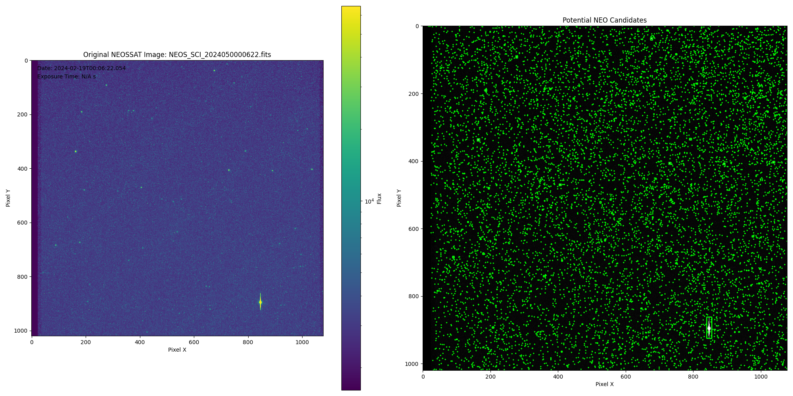
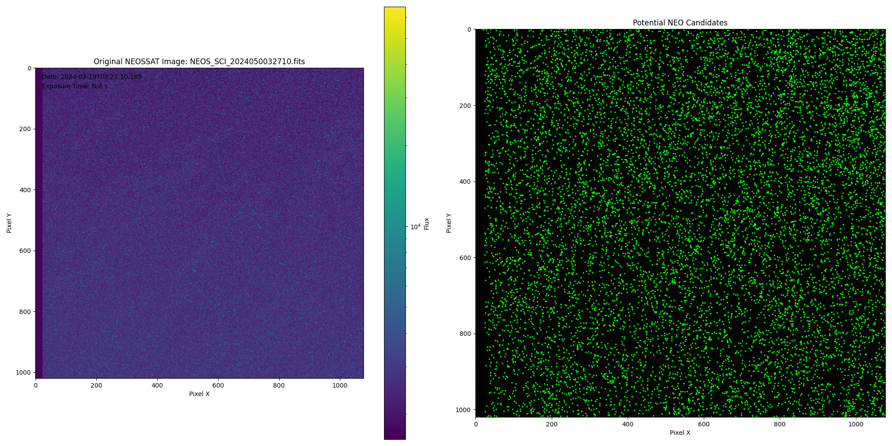

# NEOSSAT FITS Processing and Visualization Documentation

Welcome to the NEOSSAT FITS Processing and Visualization documentation. This guide provides a comprehensive overview of the entire codebase, detailing the purpose and functionality of each file, the interactions between them, and explanations of key code segments. Whether you're a developer new to the project or someone looking to understand its inner workings, this document will serve as your go-to resource.

## Table of Contents
1. [Project Overview](#project-overview)
2. [Directory Structure](#directory-structure)
3. [File Descriptions](#file-descriptions)
4. [Inter-Module Interactions](#inter-module-interactions)
5. [Setting Up the Environment](#setting-up-the-environment)
6. [Running the Application](#running-the-application)
7. [Code Samples Explained](#code-samples-explained)
8. [Troubleshooting](#troubleshooting)
9. [FAQs](#faqs)
10. [Contributing](#contributing)
11. [License](#license)

## Project Overview

The NEOSSAT FITS Processing and Visualization project is designed to handle astrophysical data in FITS (Flexible Image Transport System) format, process these files to extract meaningful information, and provide an interactive web interface for users to visualize and manipulate the data in real-time. The system facilitates batch processing of multiple FITS files, generates visualization frames, compiles them into videos, and allows users to interactively adjust visualization parameters through a user-friendly web interface.

Here are some examples of the visualizations produced by this project:


*Figure 1: Example of a processed NEOSSAT image*


*Figure 2: Another processed NEOSSAT image*

These images showcase the ability of the system to process and visualize FITS data, highlighting celestial objects and their characteristics.

## Directory Structure

Here's an overview of the project's directory structure:

[Directory structure details would go here]

## File Descriptions

### 1. visualize.py

**Purpose:**
`visualize.py` is the core processing script responsible for loading FITS files, applying image processing techniques, generating visualization frames, and compiling these frames into a video. It also updates a progress tracker and handles error logging.

**Key Functionalities:**
- Loading FITS Data: Reads and extracts image data and metadata from FITS files.
- Image Processing: Applies Gaussian filters and other image processing techniques to enhance visualizations.
- Frame Generation: Creates PNG images from processed data.
- Video Compilation: Compiles all generated frames into an MP4 video.
- Error Handling: Logs errors and continues processing without interruption when encountering faulty files.
- Progress Tracking: Updates progress.json to reflect the current processing status.

### 2. progress_app.py

**Purpose:**
`progress_app.py` is a Flask-based web application that serves as the interactive frontend for users. It enables users to view processing progress, select individual frames, adjust visualization parameters, and see real-time updates on their selections.

**Key Functionalities:**
- Serving Web Pages: Renders index.html as the main interface.
- API Endpoints:
  - `/progress`: Provides real-time processing status.
  - `/process_frame`: Handles user requests to process individual frames with adjusted parameters.
  - `/list_frames`: Lists all available frames for user selection.
  - `/static/frames/<filename>`: Serves generated frame images.
- Logging: Captures and logs application events and errors for debugging.

### 3. index.html

**Purpose:**
`index.html` serves as the frontend user interface for the application. It provides an interactive platform where users can:
- View Available Frames: Display thumbnails of all processed frames.
- Select Frames: Allow users to click on thumbnails to select a frame for detailed viewing.
- Adjust Parameters: Provide input controls for users to modify visualization parameters such as threshold percentile.
- Apply Changes: Enable users to apply their custom parameters and see the updated frame in real-time.

**Key Functionalities:**
- Dynamic Frame Loading: Fetches and displays all available frames from the server.
- User Interactions: Handles frame selection and parameter adjustments through JavaScript event listeners.
- Real-Time Updates: Sends user inputs to the backend and updates the display based on server responses.

### 4. database_integration.py

**Purpose:**
Handles interactions with the SQLite database, including creating necessary tables and inserting data extracted from FITS files.

**Key Functionalities:**
- Database Initialization: Sets up the database and creates tables if they don't exist.
- Data Insertion: Inserts processed data such as filename, observation date, exposure time, brightness, and orbit information into the database.


### 5. astrometry.py

**Purpose:**
Performs astrometric calculations to determine the orbits of Near-Earth Objects (NEOs) based on positional data extracted from FITS files.

**Key Functionalities:**
- Orbit Calculation: Computes the orbit parameters using astrometric data such as Right Ascension (RA) and Declination (Dec).
- Orbit Data Handling: Structures orbit information for storage and visualization.


### 6. interactive_visualization.py

**Purpose:**
Generates interactive plots using Plotly or similar libraries to visualize astronomical data in an interactive manner.

**Key Functionalities:**
- Plot Generation: Creates interactive visualizations that allow users to explore data dynamically.
- Handling Missing Data: Ensures that the visualization remains robust even when certain data points are missing or incomplete.


### 7. Additional Files

- **batch_processing.py**: Handles the batch processing of multiple FITS files, orchestrating the loading, processing, and visualization of each file in sequence or parallel.
- **parallel_processing.py**: (Currently Not in Use) Intended for optimizing processing by handling multiple FITS files concurrently using multiprocessing techniques.
- **test_visualization.py**: Contains unit tests to ensure that the visualization functions work as expected and to catch regressions in the codebase.
- **progress.json**: A JSON file that tracks the real-time progress of the batch processing tasks, including current file index, total files, status, brightness, and orbit data.
- **visualization_debug.txt**: A log file that records detailed debug information, errors, and status updates to aid in troubleshooting and monitoring the application's performance.

## Inter-Module Interactions

Understanding how different modules interact is crucial for grasping the overall system functionality:

- **visualize.py and progress_app.py**:
  - `visualize.py` performs the core processing of FITS files.
  - `progress_app.py` (Flask app) calls functions from `visualize.py` to process individual frames based on user inputs and serves the resulting images to the frontend.

- **database_integration.py**:
  - `visualize.py` uses functions from `database_integration.py` to store processed data into the SQLite database.

- **astrometry.py**:
  - `visualize.py` utilizes astrometric functions to calculate orbit data, which is then stored and potentially displayed in visualizations.

- **interactive_visualization.py**:
  - Facilitates the creation of interactive plots that can be integrated into either the backend or served to the frontend for enhanced user interaction.

- **index.html (Frontend) and progress_app.py (Backend)**:
  - The frontend communicates with the backend via HTTP requests to fetch frame lists, process frames, and display real-time updates based on the `progress.json` file.

## Setting Up the Environment

Before running the application, ensure that your environment is properly set up:

1. **Install Python 3.10**:
   Make sure Python 3.10 is installed on your system. You can download it from the official website.

2. **Create a Virtual Environment**:
   ```
   python -m venv venv
   ```
   - Activate the virtual environment:
     - Windows:
       ```
       venv\Scripts\activate
       ```
     - macOS/Linux:
       ```
       source venv/bin/activate
       ```

3. **Install Required Dependencies**:
   ```
   pip install -r requirements.txt
   ```
   - Note: Ensure that `requirements.txt` includes all necessary packages such as Flask, Astropy, Matplotlib, Plotly, OpenCV, etc.

4. **Directory Setup**:
   Create the necessary directories if they don't exist:
   ```
   mkdir -p static/frames NEOSSAT_Data
   ```

5. **Database Initialization**:
   The first run of `visualize.py` will automatically create the SQLite database (`neossat_data.db`) and necessary tables.

## Running the Application

Follow these steps to start processing and visualize your FITS data:

1. **Start the Flask Web Application**:
   ```
   python progress_app.py
   ```
   - The Flask server will run on `http://127.0.0.1:5000/` by default.

2. **Access the Web Interface**:
   Open your web browser and navigate to `http://127.0.0.1:5000/`.
   You will see the "NEOSSAT FITS Processing Progress" webpage.

3. **Batch Processing**:
   Run the `visualize.py` script to start batch processing of FITS files:
   ```
   python visualize.py
   ```
   - The script will process all FITS files in the specified directory, generate frames, and compile them into a video. Progress can be monitored via the web interface.

4. **Interactive Frame Processing**:
   Use the web interface to select individual frames.
   Adjust parameters such as Threshold Percentile and apply changes to see real-time updates on the selected frame.

## Code Samples Explained

### 1. Loading FITS Data

**File**: `visualize.py`
**Function**: `load_fits_data(fits_file_path)`

**Purpose**:
Loads and extracts image data and header information from a FITS file.

**Code Explanation**:
[Code explanation would go here]

**Functionality**:
- Checks if the specified FITS file exists.
- Opens the FITS file using Astropy's `fits.open`.
- Extracts image data and header information from the primary HDU (Header/Data Unit).
- Logs the progress and handles any exceptions by logging errors and re-raising them.

### 2. Processing a Single Frame

**Files Involved**:
- `progress_app.py`
- `visualize.py`

**Functionality Overview**:
When a user selects a frame and adjusts the parameters on the web interface, a POST request is sent to the `/process_frame` endpoint in `progress_app.py`. This endpoint invokes the `visualize_fits` function from `visualize.py` with the specified parameters to process the selected FITS file and generate an updated frame.

**Code Explanation**:

**progress_app.py**:
[Code explanation would go here]

**Functionality**:
- Receives JSON data containing the filename and parameters.
- Validates the presence of required data.
- Constructs the path to the FITS file.
- Extracts parameters with default values if not provided.
- Defines the output path for the modified frame.
- Calls `visualize_fits` with the specified parameters to process the FITS file.
- Returns the URL of the modified frame upon successful processing or an error message if processing fails.

**visualize.py**:
[Code explanation would go here]

**Functionality**:
- Loads FITS data and applies a Gaussian filter based on user-specified parameters (`kernel_size` and `sigma`).
- Measures brightness and inserts relevant data into the database.
- Calculates orbit data if available.
- Generates a visualization using Matplotlib, optionally overlaying orbit information.
- Saves the visualization as a PNG file if `save_fig` is True; otherwise, displays it interactively.

### 3. Handling User Requests in Flask

**File**: `progress_app.py`

**Functionality Overview**:
Handles incoming user requests to process individual frames with customized parameters and serves the resulting images back to the frontend.

**Code Explanation**:
[Code explanation would go here]

**Flow**:
1. Receive Request: Listens for POST requests at `/process_frame`.
2. Validate Data: Checks for the presence of filename and parameters in the request JSON.
3. Process Frame: Calls `visualize_fits` with the specified parameters to process the selected FITS file.
4. Respond to Client: Returns the URL of the modified frame or an error message based on processing outcome.

### 4. Frontend Interactivity

**File**: `index.html`

**Functionality Overview**:
Provides an interactive user interface that allows users to:
- View all available frames as clickable thumbnails.
- Select a frame to display in a larger view.
- Adjust visualization parameters through input controls.
- Apply changes to update the selected frame in real-time.

**Code Explanation**:
[Code explanation would go here]

**Flow**:
1. Fetch Frames: On page load, sends a GET request to `/list_frames` to retrieve all available frame filenames.
2. Display Thumbnails: Dynamically creates and displays thumbnail images for each frame.
3. Select Frame: Allows users to click on a thumbnail to select and display the frame in a larger view.
4. Adjust Parameters: Provides an input field (`threshold_percentile`) for users to adjust visualization parameters.
5. Apply Changes: Sends a POST request to `/process_frame` with the selected frame and new parameters, then updates the displayed image based on the server's response.

## Troubleshooting

### Common Issues:

1. **FITS File Not Found**:
   - Symptom: Errors indicating that a FITS file cannot be found.
   - Resolution: Ensure that all FITS files are placed in the `NEOSSAT_Data` directory and that filenames are correctly specified.

2. **Corrupted FITS Files**:
   - Symptom: Errors such as `TypeError: buffer is too small for requested array`.
   - Resolution: Review the `visualization_debug.txt` log to identify corrupted files. Re-download or regenerate these files as necessary.

3. **Flask Server Not Running**:
   - Symptom: Unable to access the web interface at `http://127.0.0.1:5000/`.
   - Resolution: Ensure that `progress_app.py` is running without errors. Check the terminal for any runtime issues.

4. **Modified Frames Not Displaying**:
   - Symptom: After applying changes, the updated frame does not appear.
   - Resolution: Ensure that the POST request to `/process_frame` returns successfully. Check the `visualization_debug.txt` for any processing errors.

5. **Caching Issues**:
   - Symptom: Updated frames are not reflected immediately.
   - Resolution: The frontend appends a timestamp query parameter to the frame URL to prevent caching. Ensure this logic is intact in `index.html`.

## FAQs

**Q1: How do I add more parameters to adjust in the visualization?**

A1: To introduce additional parameters:

1. Frontend (`index.html`):
   - Add new input fields within the `.controls` div.
   - Update the JavaScript to capture these new inputs and include them in the POST request body.

2. Backend (`progress_app.py`):
   - Modify the `/process_frame` route to extract the new parameters.
   - Pass these parameters to the `visualize_fits` function.

3. Processing Script (`visualize.py`):
   - Update the `visualize_fits` function signature to accept the new parameters.
   - Implement the necessary logic to utilize these parameters during processing.

**Q2: Can I process multiple frames simultaneously?**

A2: Currently, the system processes frames sequentially. Implementing parallel processing would require modifying the `batch_processing.py` script to handle multiprocessing, ensuring thread safety when writing to shared resources like the database and frames directory.

**Q3: How can I view the processing progress?**

A3: The `progress.json` file maintains real-time updates of the processing status. Additionally, the web interface provides a visual representation of processing progress and allows you to interact with individual frames.

**Q4: Where are the processed frames stored?**

A4: All processed frames are saved in the `static/frames/` directory. Modified frames follow the naming convention `modified_frame_<frame_number>_kp<kernel_size>_sigma<sigma>.png`.

**Q5: How do I reset the application or clean up generated files?**

A5: To reset the application:

1. Clean Up Frames:
   ```
   rm -rf static/frames/*
   ```

2. Delete the Video:
   ```
   rm -f static/output_video.mp4
   ```

3. Clear the Database:
   ```
   rm -f neossat_data.db
   ```

4. Restart the Application:
   Re-run `visualize.py` and `progress_app.py` as needed.

Note: Always back up important data before performing cleanup operations.

## Contributing

Contributions are welcome! If you'd like to improve this project, please follow these steps:

1. Fork the Repository.

2. Create a Feature Branch:
   ```
   git checkout -b feature/AmazingFeature
   ```

3. Commit Your Changes:
   ```
   git commit -m 'Add some AmazingFeature'
   ```

4. Push to the Branch:
   ```
   git push origin feature/AmazingFeature
   ```

5. Open a Pull Request.

Please ensure that your code adheres to the project's coding standards and includes appropriate tests.

## License

This project is licensed under the MIT License. You are free to use, modify, and distribute this software as per the license terms.

---

For further assistance or inquiries, please contact the project maintainer at vrspi33@gmail.com.